# Hybrid Cloud CI/CD Pipeline

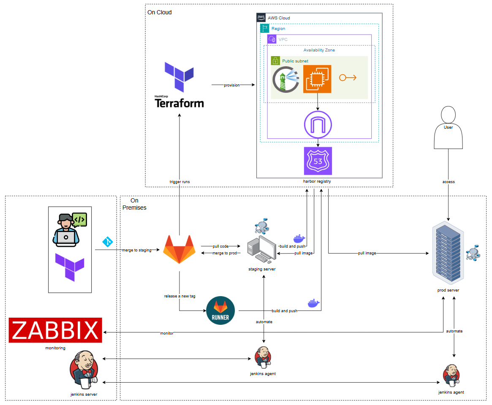

This repository contains configuration for our hybrid cloud CI/CD pipeline that spans both on-premises infrastructure and AWS Cloud deployment.

## Architecture Overview

The pipeline implements a modern DevOps workflow with infrastructure as code, continuous integration, and continuous deployment capabilities across hybrid environments:

- **Development Environment**: On-premises infrastructure where developers work with local Terraform configurations
- **Integration Environment**: GitLab for source control and limited CI pipeline
- **Deployment Environments**:
  - Staging server (on-premises)
  - Production server (on-premises)
  - AWS Cloud resources

## Component Breakdown

### On-Premises Components

- **Developer Workspace**: Local Terraform configurations for infrastructure definition
- **GitLab**: Source code repository and limited CI pipeline for builds
- **GitLab Runner**: CI job executor that handles build and push operations when triggered
- **Jenkins**: Primary automation server that orchestrates the majority of the CI/CD workflow
  - Jenkins Server: Central automation controller
  - Jenkins Agents: Distributed workers for pipeline tasks
  - **Staging Server Actions**: start, stop, rollback, upcode
  - **Production Server Actions**: start, stop, restart
- **Staging Server**: Pre-production environment for testing
- **Production Server**: Live environment serving end users
- **Zabbix**: Monitoring solution for infrastructure and application health
- **Harbor Registry**: Container registry for storing and distributing Docker images

### Cloud Components (AWS)

- **AWS Cloud**: Public cloud environment
  - **Region**: AWS geographic deployment area
  - **VPC**: Virtual Private Cloud network isolation
  - **Availability Zone**: Redundant data center for high availability
  - **Public Subnet**: Network segment for publicly accessible resources
  - **Services**:
    - Compute resources (EC2 instances)
    - Harbor registry for Docker images

## Workflow

1. **Development**:
   - Developer writes code and Terraform configurations
   - Changes are merged to staging branch in GitLab
   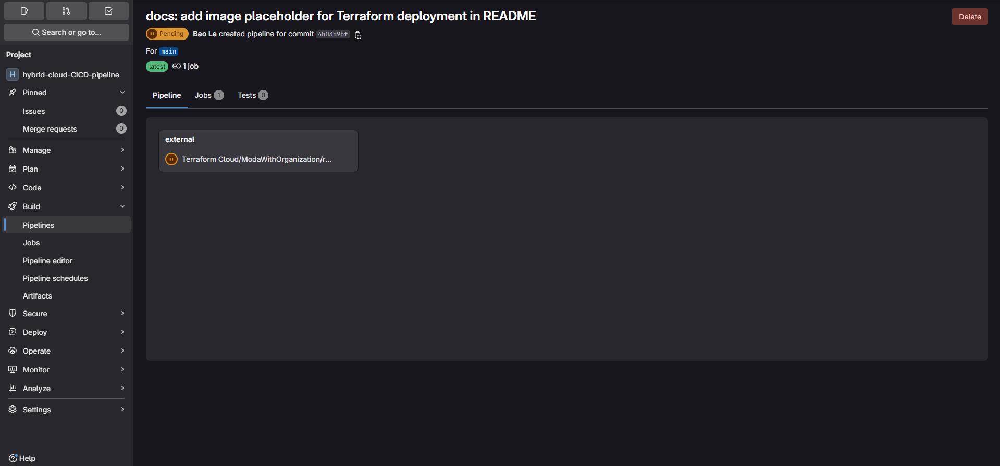
   - Approve request to provision resources in AWS
   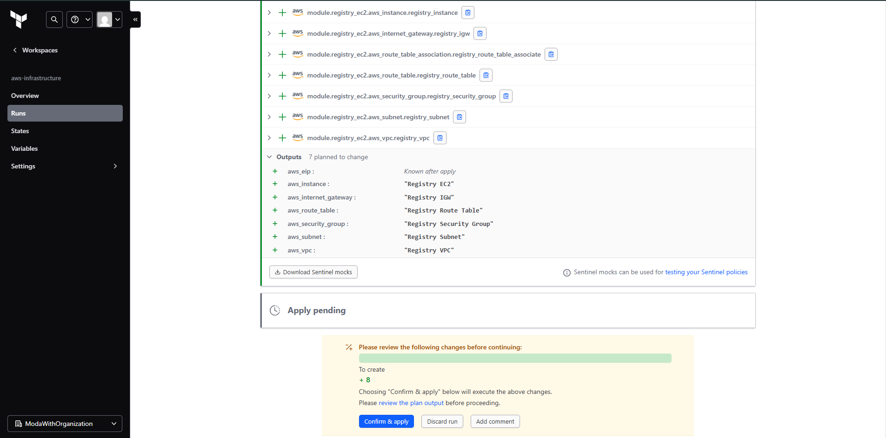
   - Create resources in AWS
   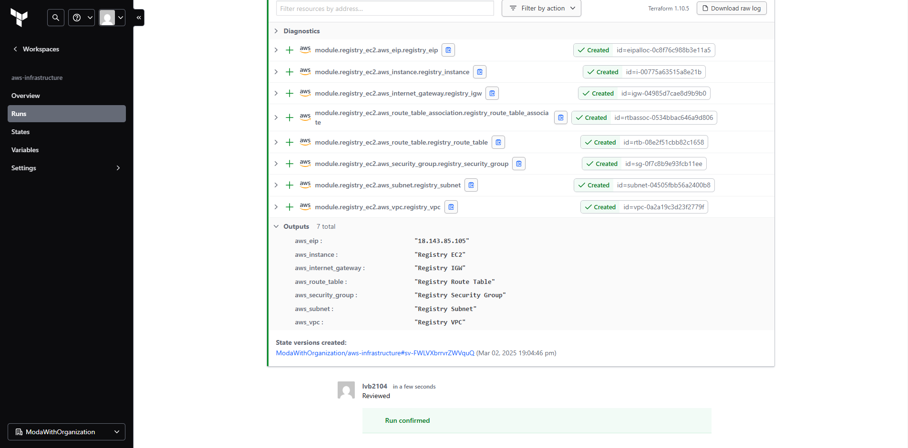
   - Deploy Harbor registry in AWS
   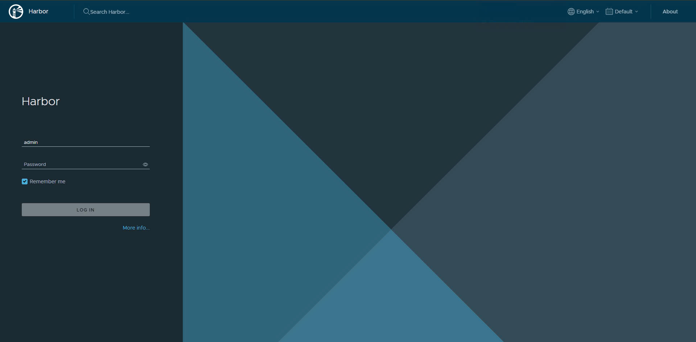

2. **Staging Process**:
   - Staging server pulls code from staging branch
   - Builds application and pushes Docker images to Harbor registry
   - Staging server pulls images from Harbor for testing
   - Tests are executed against staging environment
   - Available Jenkins actions:
     - **upcode**: Updates code by pulling from repository, building new images, and deploying
   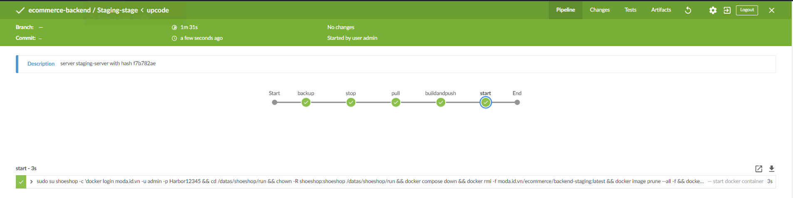
   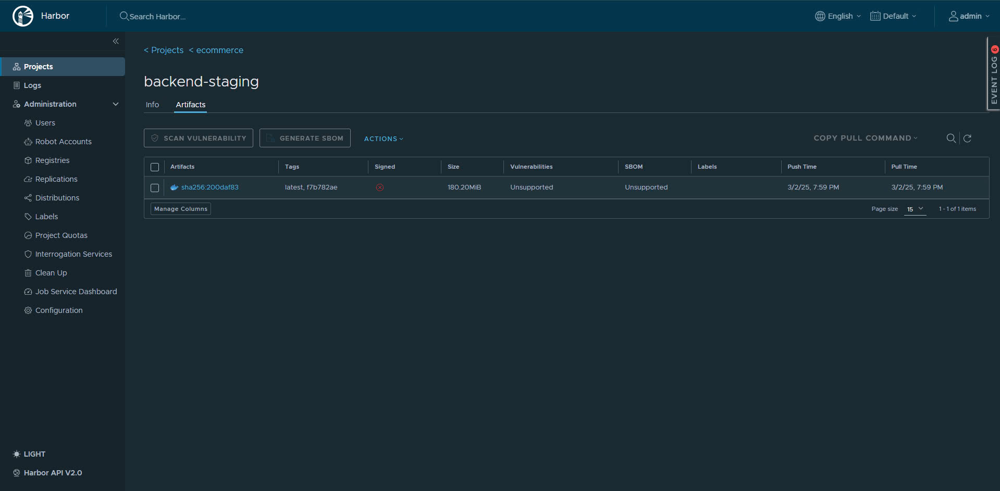
     - **start**: Starts containers with the latest images
   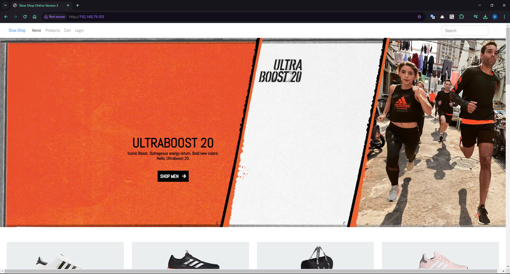
     - **stop**: Stops running containers
   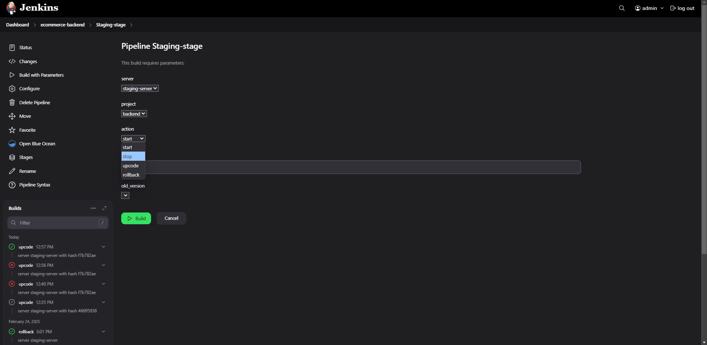
   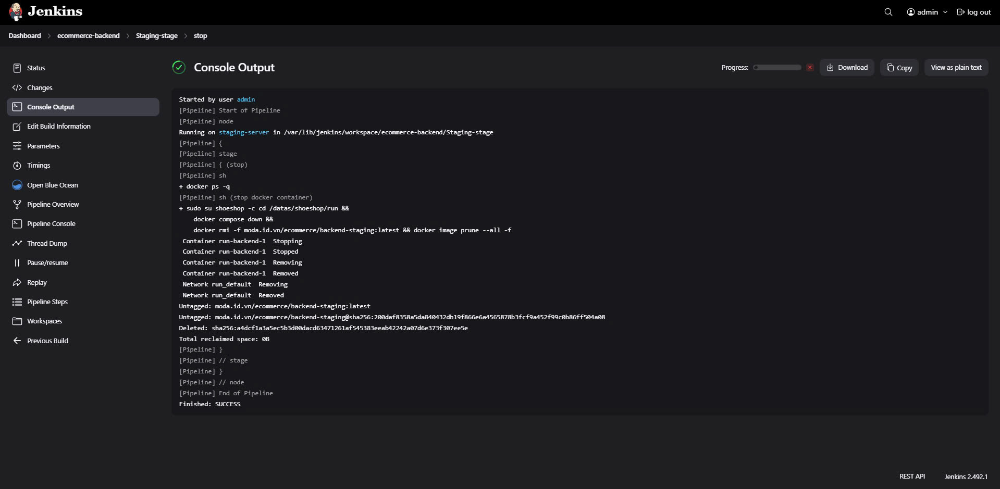
   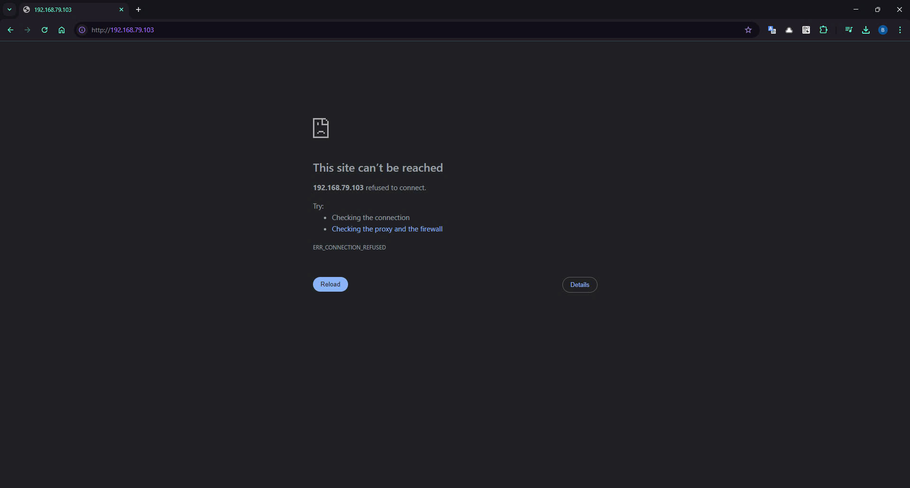
     - **rollback**: Reverts to a previous version in case of issues

3. **Release Process**:
   - Upon successful testing, a new tag is released (not merging to main)
   - GitLab Runner is triggered by the new tag
   - Runner builds and pushes images to Harbor registry
   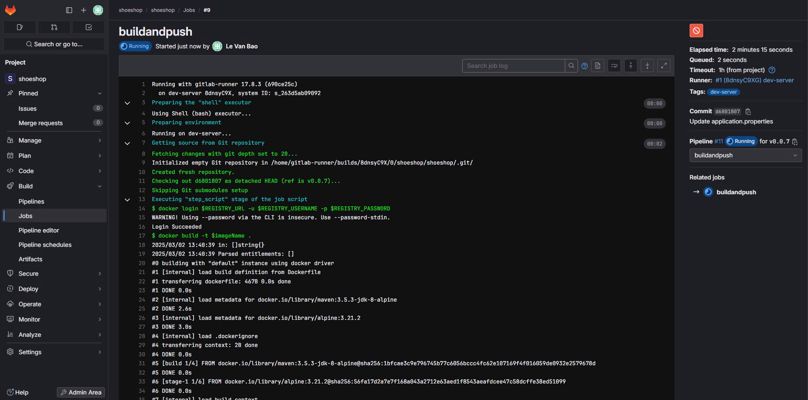
   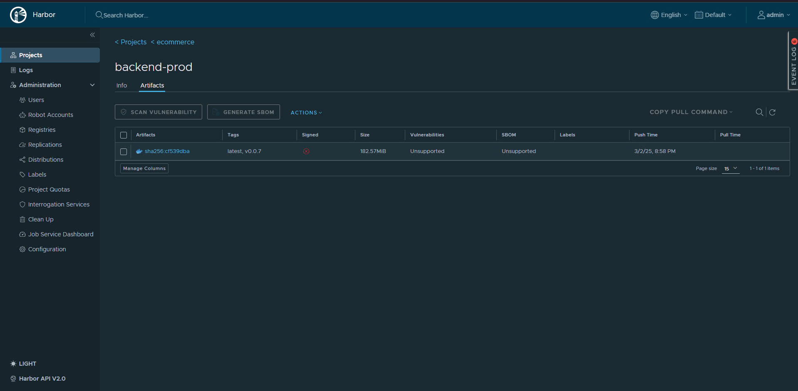

4. **Production Deployment**:
   - Production server pulls the tagged images from Harbor registry
   - Jenkins orchestrates deployment to production environment
   - Application is deployed for user access
   - Available Jenkins actions:
     - **start**: Starts containers with the latest images
   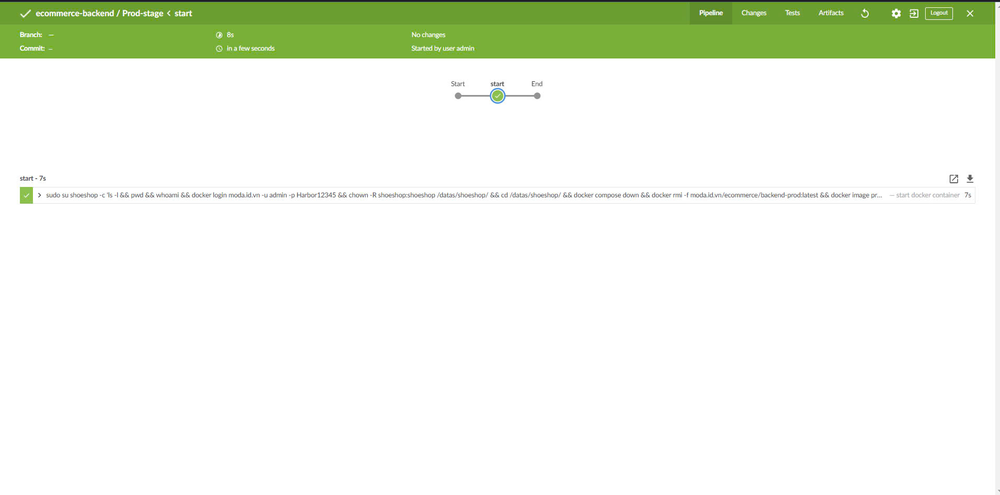
   
     - **stop**: Stops running containers
     - **restart**: Restarts containers without changing image versions

5. **Operations**:
   - Zabbix continuously monitors all environments
   - Alerts are sent for any issues detected
   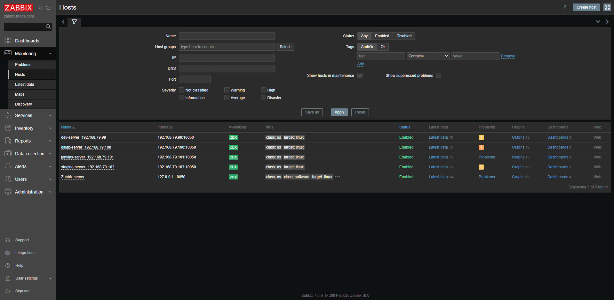
   - Testing with stop action
   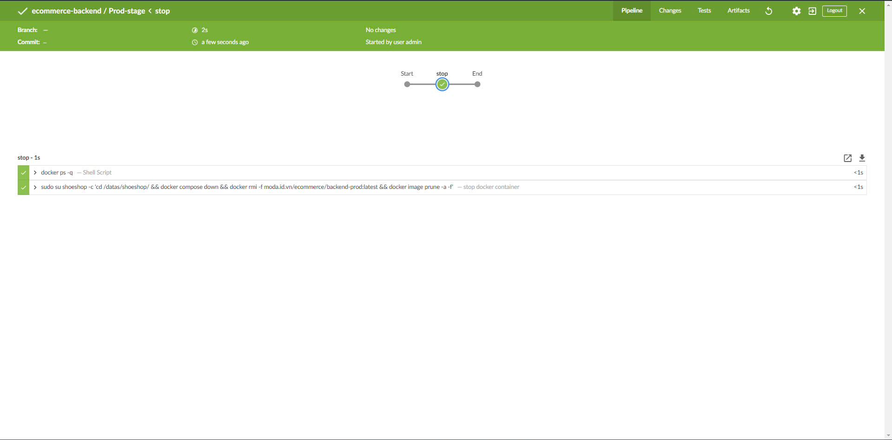
   - Zabbix alerts with items and triggers
   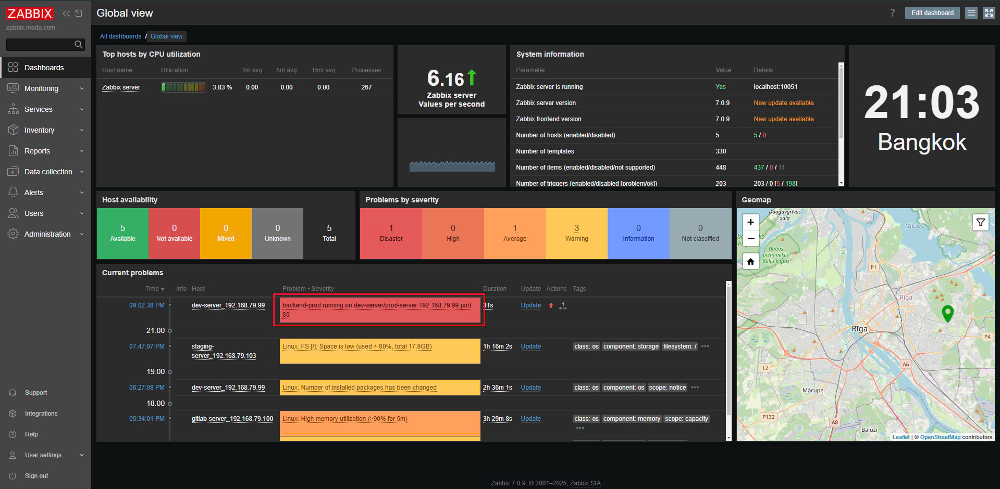
   - Jenkins agents provide automation support for operational tasks

## Key Features

- **Infrastructure as Code**: Terraform manages cloud resources
- **Hybrid Deployment**: Seamless workflow across on-premises and cloud environments
- **Containerization**: Docker containers ensure consistency across environments
- **Automation**: GitLab CI handling builds when tags are created, with Jenkins orchestrating deployments
- **Monitoring**: Comprehensive monitoring with Zabbix
- **Security**: Network segmentation and access controls

## Configuration

Detailed configuration instructions for each component can be found in their respective directories:

- `/AWS` - Infrastructure as code configurations
- `/Pipeline/gitlab-ci` - Pipeline definitions
- `/Pipeline/*.groovy` - Jenkins job configurations
- `/Docker` - Container definitions
- `/Script` - Utility scripts for automation installation

## Maintenance

Regular maintenance tasks include:

- Reviewing and rotating access credentials
- Updating base images and dependencies
- Monitoring resource usage and scaling as needed
- Performing security patches and updates
